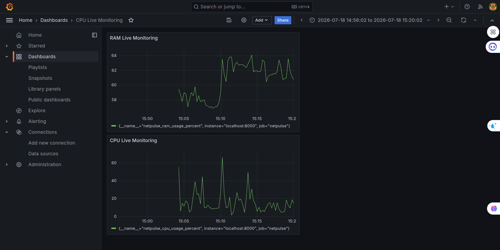

```markdown
# NetPulse - Smart Network & Server Resource Monitoring

**NetPulse** is a lightweight, high-performance network and server monitoring solution designed to collect real-time system metrics, store them in a time-series database, and visualize them through an interactive graphical dashboard.

---

## 🏗️ Architecture & Technologies

The system consists of three main layers:

1. **Metrics Exporter (Python):** Collects CPU and RAM metrics from the system using `psutil` and exposes them on an HTTP server via `prometheus_client`.
2. **Time-Series Storage (Prometheus):** Scrapes metrics every 5 seconds from the Python exporter on port `8000` and stores them for query analysis.
3. **Visualization Layer (Grafana):** Connects to Prometheus as a data source to generate dynamic time-series charts and real-time alertable panels.

---

## 🛠️ Tech Stack

- **Language:** Python 3.12
- **Libraries:** `psutil`, `prometheus_client`
- **Database:** Prometheus (v2.51+)
- **Visualization:** Grafana (v10.4+)
- **OS Platform:** Linux (Ubuntu)

---

## 🚀 Getting Started

Follow these instructions to get a copy of the project up and running on your local machine.

### Prerequisites

Ensure you have Python 3, Prometheus, and Grafana installed on your system.

### 1. Clone the Repository

```bash
git clone [https://github.com/Narjes-Rezaei/Network-Engineering.git](https://github.com/Narjes-Rezaei/Network-Engineering.git)
cd NetPulse
```

### 2. Set Up Virtual Environment

```bash
python3 -m venv venv
source venv/bin/activate
pip install psutil prometheus_client
```

### 3. Start the Metrics Exporter

Run the Python monitoring script:

```bash
python monitor.py
```

*The exporter will run at `http://localhost:8000`.*

### 4. Configure & Start Prometheus

Ensure your `prometheus.yml` contains the `netpulse` target:

```yaml
scrape_configs:
  - job_name: 'netpulse'
    static_configs:
      - targets: ['localhost:8000']
```

Start Prometheus:

```bash
./prometheus --config.file=prometheus.yml
```

*Prometheus UI will be accessible at `http://localhost:9090`.*

### 5. Launch Grafana

Start the Grafana service:

```bash
sudo systemctl start grafana-server
```

1. Open `http://localhost:3000` in your browser.
2. Add **Prometheus** (`http://localhost:9090`) as a Data Source.
3. Query `netpulse_cpu_usage_percent` and `netpulse_ram_usage_percent` to build your dashboard.

---

## 📊 Dashboard Preview



## 👤 Author

* **Name:** Narjes Rezaei
* **Field:** Computer Engineering (8th Semester)
